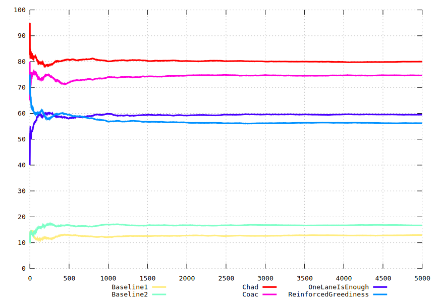

```sh
source setup.sh
source prepare.sh
source run.sh > out-1.txt &
source run.sh > out-2.txt &
source run.sh > out-3.txt &
source run.sh > out-4.txt &
wait
source run.sh > out-5.txt &
source run.sh > out-6.txt &
source run.sh > out-7.txt &
wait
source graph.sh
```
