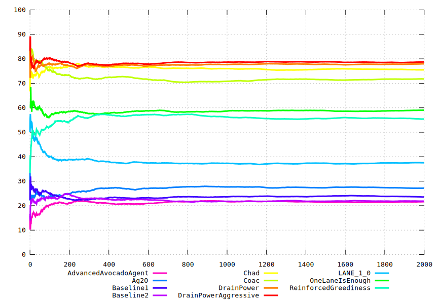

```sh
export NUMEXPR_NUM_THREADS=1
export MKL_NUM_THREADS=1
export OMP_NUM_THREADS=1
source setup.sh
source prepare.sh
source run.sh > out-1.txt &
source run.sh > out-2.txt &
source run.sh > out-3.txt &
source run.sh > out-4.txt &
wait
source graph.sh
```
